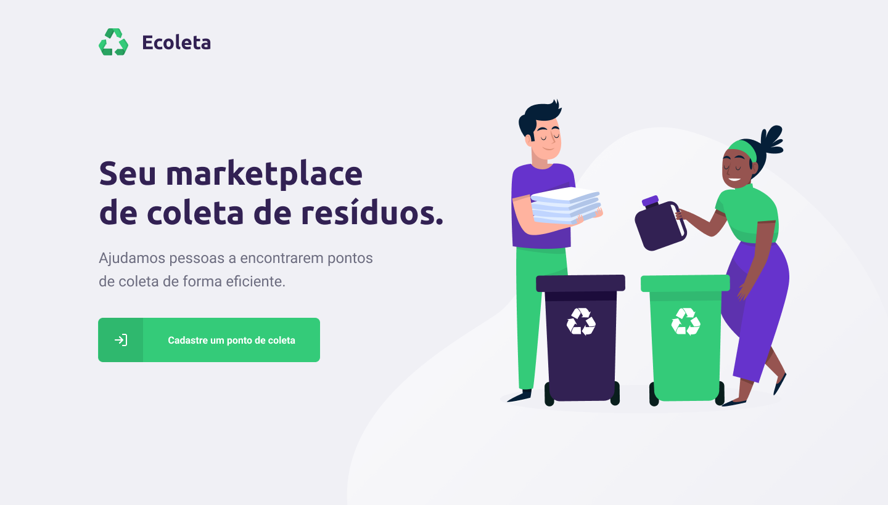

## :rocket: Ecoleta

<p align="center">
  
</p>

O Ecoleta é uma aplicação desenvolvida na [Next Level Week](https://nextlevelweek.com/), semana realizada pela [Rocketseat](https://rocketseat.com.br/) focada na stack NojeJs, Reack e React Native. o Ecoleta é um Marketplace de coleta de resíduos com o objetivo de ajudar pessoas a encontrarem pontos de coleta de forma eficiente.

<p align="center">
  
</p>

A prototipação completa do projeto pode ser visualizada no Figma [clique aqui](https://www.figma.com/file/9TlOcj6l7D05fZhU12xWT3/Ecoleta-(Booster)?node-id=0%3A1)

## :hammer_and_pick: Para executar a aplicação: 

## Api/Backend
```bash
$ cd api
$ npm install
$ npm run dev
```
## SQLite
```
$ cd api
$ npm run nkex:migrate
$ npm run knex:seed
```
## Frontend Web
```bash
$ cd web
$ npm install
$ npm start
``` 

## Frontend Mobile
```bash
$ cd mobile
# npm install
$ npm start
# ou 
$ expo start
```

# :computer: Libs utilizadas

## API
* [Node.JS](https://nodejs.org/en/docs/)
* [Express](https://expressjs.com/)
* [TypeScript](https://www.typescriptlang.org/)
* [SQLite](https://www.sqlite.org/index.html)
* [Knex](http://knexjs.org/)
* [Multer](https://www.npmjs.com/package/multer)
* [Cors](https://github.com/expressjs/cors)

## Web
* [ReactJS](https://reactjs.org/)
* [TypeScript](https://www.typescriptlang.org/)
* [Leaflet](https://leafletjs.com/)
* [ReactDropzone](https://react-dropzone.js.org/)
* [Axios](https://github.com/axios/axios)

## Mobile
* [React Native](https://reactnative.dev/)
* [Expo](https://docs.expo.io/)
* [Axios](https://github.com/axios/axios)
* [Mail Composer](https://docs.expo.io/versions/latest/sdk/mail-composer/)
* [Map View](https://docs.expo.io/versions/latest/sdk/map-view/)
